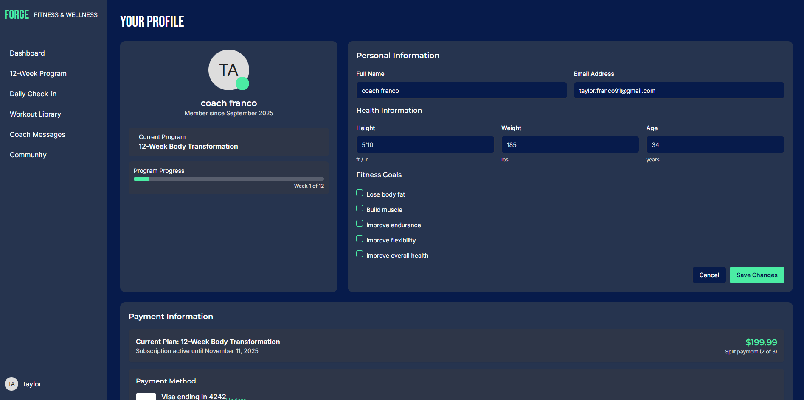

# Mind Body Reset — App Prototype  
 
   

A mobile-first fitness prototype showcasing real-world frontend skills: I owned UI/UX design, prototyping, and responsive design, building real features (dashboard, 12-week program, daily check-ins, coach messaging, community, profile). I focused on accessibility (A11y) and performed manual QA testing across devices to ensure consistent behavior. The repo includes thoughtful project documentation and screenshots to showcase flows. Tech & skills used: React, JavaScript (ES6+), HTML5, CSS3, UI/UX Design, Prototyping, Responsive Design, Accessibility (A11y), Manual QA Testing.

## 🔑 Key Features  
- **Role-based dashboard** with personalized user profile  
- **12-week transformation program** tracker  
- **Daily check-in system** for consistency  
- **Coach messaging** for accountability  
- **Community section** for social support  
- Designed with a focus on **usability, accessibility, and responsive layouts**  

## Why this project matters  
This prototype demonstrates more than static pages, it shows my ability to design and implement **practical, real-world features** that companies use every day. From personalized dashboards to messaging systems, I approached it as if I were solving actual product problems.  

While this project was tested manually, I also have experience applying **QA automation (Selenium + Python)** on past work, so I understand how to bring both functionality and reliability into production.  

## 📸 Screenshots  

Here’s a preview of the **Mind Body Reset Mobile App Prototype**:  

  

| Dashboard | 12-Week Program | Daily Check-in |  
|-----------|-----------------|----------------|  
|  Main dashboard showing weekly plan and quick stats. |  12-week structured program with milestones. |  Track mood, meals, and hydration daily. |  

| Workout Library | Coach Messages | Community |  
|-----------------|----------------|-----------|  
|  Exercise database with guided workouts. |  Direct messages from your coach for accountability. |  Group forum for encouragement and sharing results. |  

| Profile |  
|---------|  
|  Personal profile with progress tracking and achievements. |  

  

## Tech Stack  
- Frontend built with **React concepts** (prototyped in Replit)  
- Responsive UI with semantic HTML & CSS  
- Deployed demo video + GitHub repo for showcase  

## 🎥 Demo Video  
  
*Click to watch on YouTube (opens in a new tab).*  

---

## Contact
- **LinkedIn:** [Taylor Franco](https://www.linkedin.com/in/taylor-franco-982518140/)  
- **Email:** taylor.franco91@gmail.com  
- **Portfolio:** [taylor-franco-portfolio.netlify.app](https://taylor-franco-portfolio.netlify.app/)  

---

