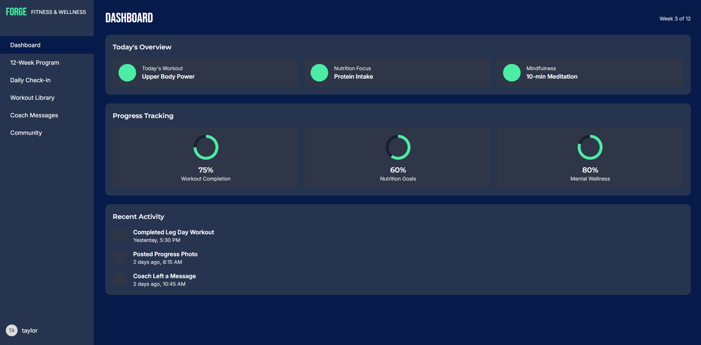
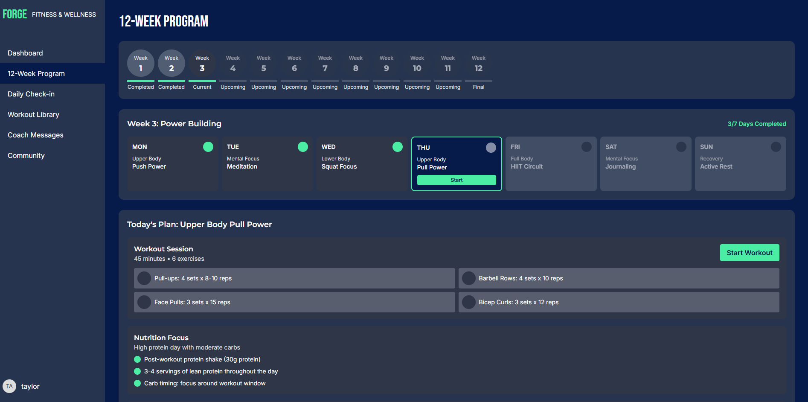
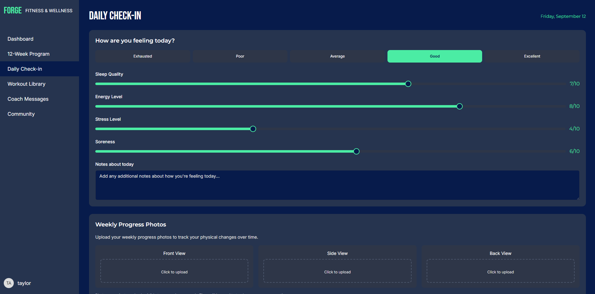
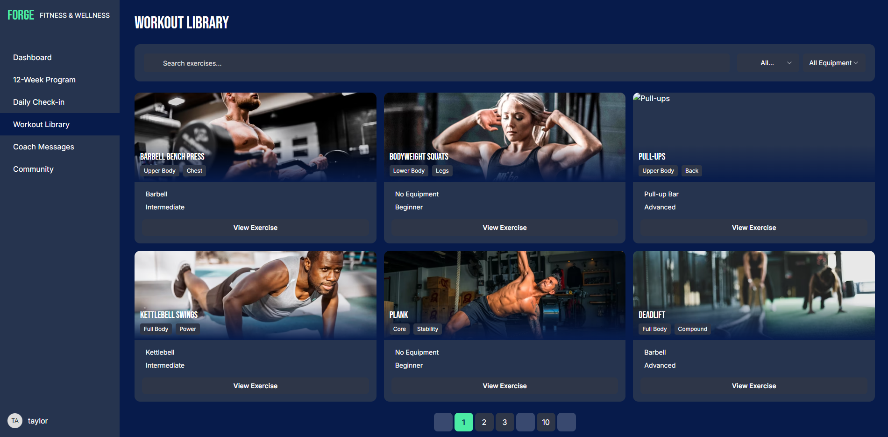
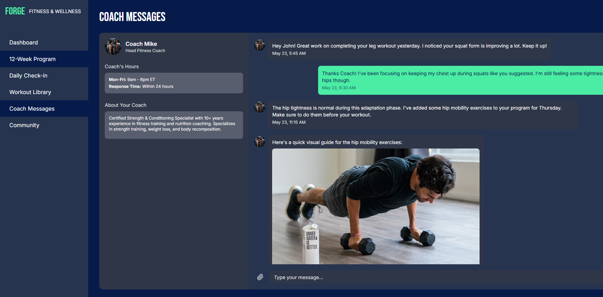
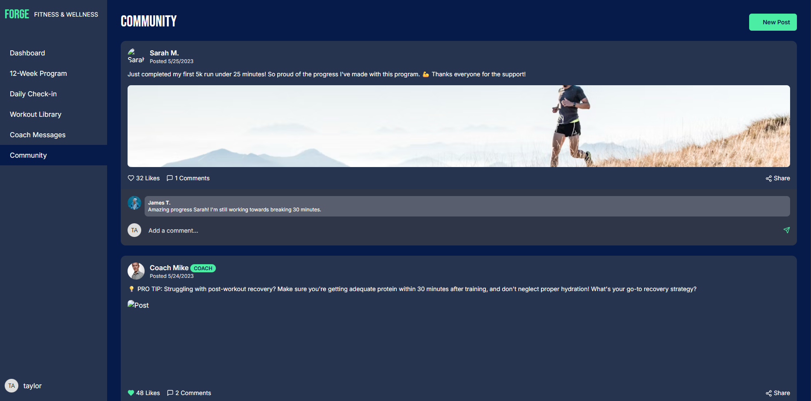

# Mind Body Reset — App Prototype  

A fitness and wellness app prototype built to showcase **frontend engineering skills** with real-world features like dashboards, messaging, check-ins, and community engagement.  

## Highlights  
- **Role-based dashboard** with personalized user profile  
- **12-week transformation program** tracker  
- **Daily check-in system** for consistency  
- **Coach messaging** for accountability  
- **Community section** for social support  
- Designed with a focus on **usability, accessibility, and responsive layouts**  

## Why this project matters  
This prototype demonstrates more than static pages — it shows my ability to design and implement **practical, real-world features** that companies use every day. From personalized dashboards to messaging systems, I approached it as if I were solving actual product problems.  

While this project was tested manually, I also have experience applying **QA automation (Selenium + Python)** on past work, so I understand how to bring both functionality and reliability into production.  

## 📸 Screenshots  

Here’s a preview of the **Mind Body Reset Mobile App Prototype**:  

  

| Dashboard | 12-Week Program | Daily Check-in |  
|-----------|-----------------|----------------|  
|  Main dashboard showing weekly plan and quick stats. |  12-week structured program with milestones. |  Track mood, meals, and hydration daily. |  

| Workout Library | Coach Messages | Community |  
|-----------------|----------------|-----------|  
|  Exercise database with guided workouts. |  Direct messages from your coach for accountability. |  Group forum for encouragement and sharing results. |  

## Tech  
- Frontend built with **React concepts** (prototyped in Replit)  
- Responsive UI with semantic HTML & CSS  
- Deployed demo video + GitHub repo for showcase  

## Live Demo  
🎥 **[Watch the demo video](#)** <!-- Replace # with your GitHub video link -->  

## Contact  
- **LinkedIn:** [https://www.linkedin.com/in/taylor-franco-982518140/](https://www.linkedin.com/in/taylor-franco-982518140/)  
- **Email:** taylor.franco91@gmail.com  
- **Portfolio:** [https://taylor-franco-portfolio.netlify.app/](https://taylor-franco-portfolio.netlify.app/)  

